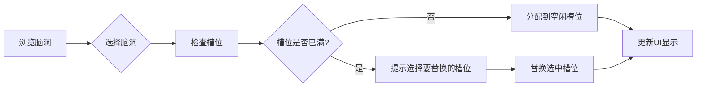

# 多脑洞并行生成功能 - 需求文档

## 1. 功能概述

### 1.1 核心需求
用户可以选择**最多3个不同的脑洞**，每个脑洞都可以**独立生成**对应的大纲、小说和剧本，形成3条并行的创作线路。

### 1.2 用户场景
- 用户看到多个感兴趣的脑洞，难以抉择
- 想要对比不同脑洞的发展潜力
- 希望同时推进多个创意，最后选择最满意的

## 2. 功能详细设计

### 2.1 脑洞选择机制

#### 2.1.1 选择规则
- **最多选择3个**脑洞（超过3个时提示已达上限）
- 每个选中的脑洞分配到**槽位**：槽位1、槽位2、槽位3
- 可以**取消选择**释放槽位
- 可以**替换**已选择的脑洞

#### 2.1.2 视觉设计
```
┌─────────────────────────────────┐
│  已选择的脑洞 (2/3)             │
│                                 │
│  [槽位1] 时间旅行者的悖论 ✓     │
│  [槽位2] AI恋人 ✓               │
│  [槽位3] <空闲，点击选择>       │
└─────────────────────────────────┘
```

### 2.2 多线程创作管理

#### 2.2.1 创作线路标识
每个脑洞生成独立的创作线路，使用颜色和编号区分：
- **线路1**：紫色 `#667eea`
- **线路2**：蓝色 `#4F46E5`  
- **线路3**：绿色 `#10B981`

#### 2.2.2 进度追踪
```javascript
// 数据结构
const creationLines = {
    line1: {
        idea: { id: 'b1-1', title: '时间旅行者的悖论', content: '...' },
        outline: { status: 'generating', progress: 45, data: null },
        novel: { status: 'pending', progress: 0, data: null },
        script: { status: 'pending', progress: 0, data: null }
    },
    line2: {
        idea: { id: 'b1-3', title: 'AI恋人', content: '...' },
        outline: { status: 'completed', progress: 100, data: '...' },
        novel: { status: 'generating', progress: 20, data: null },
        script: { status: 'pending', progress: 0, data: null }
    },
    line3: null // 未使用
};
```

### 2.3 界面布局调整

#### 2.3.1 顶部导航栏改造
```html
<!-- 原设计：单一进度条 -->
<div class="nav-progress">
    <div class="progress-bg" style="width: 25%;"></div>
    <div class="progress-step active">脑洞</div>
    <div class="progress-step">大纲</div>
    <div class="progress-step">小说</div>
    <div class="progress-step">剧本</div>
</div>

<!-- 新设计：多线路进度 -->
<div class="nav-multi-progress">
    <!-- 线路切换标签 -->
    <div class="line-tabs">
        <button class="line-tab active" data-line="1">
            <span class="line-color" style="background: #667eea"></span>
            线路1
        </button>
        <button class="line-tab" data-line="2">
            <span class="line-color" style="background: #4F46E5"></span>
            线路2
        </button>
        <button class="line-tab disabled" data-line="3">
            <span class="line-color" style="background: #10B981"></span>
            未使用
        </button>
    </div>
    
    <!-- 当前线路进度 -->
    <div class="current-line-progress">
        <div class="progress-bg" style="width: 50%;"></div>
        <div class="progress-steps">
            <span class="step completed">脑洞</span>
            <span class="step active">大纲</span>
            <span class="step">小说</span>
            <span class="step">剧本</span>
        </div>
    </div>
</div>
```

#### 2.3.2 左侧展示区改造
根据当前选择的线路切换显示内容：
- **脑洞阶段**：显示所有可选脑洞卡片
- **大纲阶段**：显示当前线路的大纲内容
- **小说阶段**：显示当前线路的小说内容
- **剧本阶段**：显示当前线路的剧本内容

#### 2.3.3 悬浮管理面板
```html
<!-- 悬浮在右下角的管理面板 -->
<div class="creation-manager">
    <button class="manager-toggle">
        <i class="fas fa-layer-group"></i>
        <span class="badge">2</span> <!-- 活跃线路数 -->
    </button>
    
    <!-- 展开后的面板 -->
    <div class="manager-panel">
        <h4>创作线路管理</h4>
        
        <!-- 线路1 -->
        <div class="line-card">
            <div class="line-header">
                <span class="line-badge" style="background: #667eea"></span>
                <span class="line-title">时间旅行者的悖论</span>
                <button class="line-action">查看</button>
            </div>
            <div class="line-progress">
                <div class="step-indicators">
                    <span class="indicator completed">脑</span>
                    <span class="indicator active">纲</span>
                    <span class="indicator">说</span>
                    <span class="indicator">剧</span>
                </div>
                <div class="progress-bar">
                    <div class="progress-fill" style="width: 35%"></div>
                </div>
            </div>
        </div>
        
        <!-- 线路2 -->
        <div class="line-card">
            <!-- 类似结构 -->
        </div>
        
        <!-- 添加新线路 -->
        <button class="add-line-btn">
            <i class="fas fa-plus"></i> 添加新线路 (1/3)
        </button>
    </div>
</div>
```

### 2.4 交互流程

#### 2.4.1 选择脑洞流程


#### 2.4.2 生成大纲流程
```javascript
// 用户点击"生成大纲"
async function generateOutline(lineId) {
    // 1. 获取该线路的脑洞数据
    const line = creationLines[`line${lineId}`];
    if (!line || !line.idea) {
        showError('请先选择脑洞');
        return;
    }
    
    // 2. 更新状态为生成中
    updateLineStatus(lineId, 'outline', 'generating');
    
    // 3. 调用API（带上脑洞信息）
    const response = await callAPI('/api/generate-outline', {
        idea_id: line.idea.id,
        idea_title: line.idea.title,
        idea_content: line.idea.content,
        line_id: lineId
    });
    
    // 4. 更新线路数据
    creationLines[`line${lineId}`].outline = {
        status: 'completed',
        progress: 100,
        data: response.data
    };
    
    // 5. 更新UI
    updateLineDisplay(lineId);
}
```

#### 2.4.3 线路切换
```javascript
// 切换查看不同线路
function switchToLine(lineId) {
    // 1. 更新标签激活状态
    document.querySelectorAll('.line-tab').forEach(tab => {
        tab.classList.toggle('active', tab.dataset.line === lineId);
    });
    
    // 2. 切换显示内容
    const line = creationLines[`line${lineId}`];
    if (line) {
        displayLineContent(line);
        updateProgressBar(line);
    }
    
    // 3. 保存当前查看的线路
    localStorage.setItem('currentLine', lineId);
}
```

### 2.5 数据存储

#### 2.5.1 本地存储结构
```javascript
// localStorage
{
    // 创作线路数据
    "creationLines": {
        "line1": { /* 完整数据 */ },
        "line2": { /* 完整数据 */ },
        "line3": null
    },
    
    // 当前状态
    "currentState": {
        "activeLine": 1,        // 当前查看的线路
        "usedSlots": 2,        // 已使用的槽位数
        "lastUpdate": "2024-01-20T10:30:00"
    },
    
    // 历史记录
    "history": [
        {
            "action": "select_idea",
            "lineId": 1,
            "ideaId": "b1-1",
            "timestamp": "2024-01-20T10:25:00"
        }
    ]
}
```

#### 2.5.2 会话恢复
```javascript
// 页面加载时恢复会话
window.addEventListener('DOMContentLoaded', () => {
    const saved = localStorage.getItem('creationLines');
    if (saved) {
        const data = JSON.parse(saved);
        
        // 恢复线路数据
        creationLines = data;
        
        // 恢复UI状态
        restoreUIState();
        
        // 显示恢复提示
        showNotification('已恢复上次的创作进度', 'success');
    }
});
```

### 2.6 后端API调整

#### 2.6.1 新增参数
所有API调用需要增加 `line_id` 参数：
```javascript
// 生成大纲
POST /api/generate-outline
{
    "idea_id": "b1-1",
    "idea_title": "时间旅行者的悖论",
    "idea_content": "...",
    "line_id": 1  // 新增：标识是哪条线路
}

// 生成小说
POST /api/generate-novel
{
    "outline_data": "...",
    "line_id": 2  // 新增：标识是哪条线路
}
```

#### 2.6.2 响应格式
```javascript
{
    "status": "success",
    "line_id": 1,  // 返回线路ID
    "data": {
        // 实际内容
    },
    "metadata": {
        "generated_at": "2024-01-20T10:30:00",
        "token_used": 1500
    }
}
```

## 3. 样式设计

### 3.1 线路颜色系统
```css
:root {
    --line-1-color: #667eea;  /* 紫色 */
    --line-2-color: #4F46E5;  /* 蓝色 */
    --line-3-color: #10B981;  /* 绿色 */
    --line-inactive: #6B7280; /* 灰色 */
}

/* 选中的脑洞卡片边框 */
.idea-card.selected-line-1 {
    border: 2px solid var(--line-1-color);
    box-shadow: 0 0 0 4px rgba(102, 126, 234, 0.1);
}

.idea-card.selected-line-2 {
    border: 2px solid var(--line-2-color);
    box-shadow: 0 0 0 4px rgba(79, 70, 229, 0.1);
}

.idea-card.selected-line-3 {
    border: 2px solid var(--line-3-color);
    box-shadow: 0 0 0 4px rgba(16, 185, 129, 0.1);
}
```

### 3.2 管理面板样式
```css
/* 悬浮管理器 */
.creation-manager {
    position: fixed;
    bottom: 2rem;
    right: 2rem;
    z-index: 1000;
}

.manager-toggle {
    width: 60px;
    height: 60px;
    border-radius: 50%;
    background: var(--primary-gradient);
    border: none;
    color: white;
    box-shadow: 0 4px 12px rgba(0, 0, 0, 0.15);
    cursor: pointer;
    transition: transform 0.3s ease;
}

.manager-toggle:hover {
    transform: scale(1.1);
}

.manager-panel {
    position: absolute;
    bottom: 70px;
    right: 0;
    width: 320px;
    background: var(--dark-card);
    border-radius: 12px;
    padding: 1.5rem;
    box-shadow: 0 10px 40px rgba(0, 0, 0, 0.3);
    opacity: 0;
    transform: translateY(20px) scale(0.9);
    pointer-events: none;
    transition: all 0.3s ease;
}

.manager-panel.active {
    opacity: 1;
    transform: translateY(0) scale(1);
    pointer-events: all;
}
```

## 4. 交互细节

### 4.1 选择脑洞时
- **单击卡片**：预览模式（卡片放大显示详情）
- **点击"选择"按钮**：添加到空闲槽位
- **已选满3个时**：弹出替换对话框

### 4.2 生成内容时
- **显示进度条**：实时更新生成进度
- **支持取消**：生成过程中可以取消
- **后台生成**：切换到其他线路不影响当前生成

### 4.3 查看内容时
- **Tab切换**：顶部标签快速切换线路
- **快捷键**：`Ctrl+1/2/3` 切换到对应线路
- **对比模式**：同时查看多个线路的内容

## 5. 错误处理

### 5.1 常见错误场景
1. **槽位已满**：友好提示"已选择3个脑洞，请先取消一个"
2. **生成失败**：自动重试3次，失败后显示"重新生成"按钮
3. **数据丢失**：从localStorage恢复，或提示重新开始

### 5.2 错误提示设计
```javascript
// 统一的错误提示
function showError(message, type = 'error') {
    const toast = document.createElement('div');
    toast.className = `toast toast-${type}`;
    toast.innerHTML = `
        <i class="fas fa-exclamation-circle"></i>
        <span>${message}</span>
    `;
    document.body.appendChild(toast);
    
    setTimeout(() => toast.remove(), 3000);
}
```

## 6. 性能优化

### 6.1 懒加载
- 只加载当前查看线路的内容
- 其他线路数据按需加载

### 6.2 缓存策略
- 已生成的内容缓存到localStorage
- 图片等资源使用浏览器缓存

### 6.3 并发控制
- 最多同时2个生成请求
- 队列管理待处理请求

## 7. 实现步骤

### Phase 1：基础功能（2天）
- [ ] 多选脑洞UI
- [ ] 槽位管理逻辑
- [ ] 线路数据结构

### Phase 2：生成管理（2天）
- [ ] 多线路进度追踪
- [ ] 后台生成支持
- [ ] 线路切换功能

### Phase 3：UI完善（1天）
- [ ] 管理面板
- [ ] 进度可视化
- [ ] 动画效果

### Phase 4：优化测试（1天）
- [ ] 性能优化
- [ ] 错误处理
- [ ] 用户测试

## 8. 附录

### 8.1 数据流图
```
用户选择脑洞 → 分配槽位 → 生成大纲 → 生成小说 → 生成剧本
     ↓            ↓           ↓          ↓          ↓
   线路1        线路1       线路1      线路1      线路1
   线路2        线路2       线路2      线路2      线路2  
   线路3        线路3       线路3      线路3      线路3
```

### 8.2 状态机
```
IDLE → SELECTING → SELECTED → GENERATING_OUTLINE → OUTLINE_DONE → 
GENERATING_NOVEL → NOVEL_DONE → GENERATING_SCRIPT → COMPLETE
```

### 8.3 技术依赖
- 原有流式输出技术
- localStorage API
- CSS Grid/Flexbox
- ES6+ JavaScript

---

**文档版本**：1.0.0  
**更新时间**：2024-01-20  
**作者**：AI助手